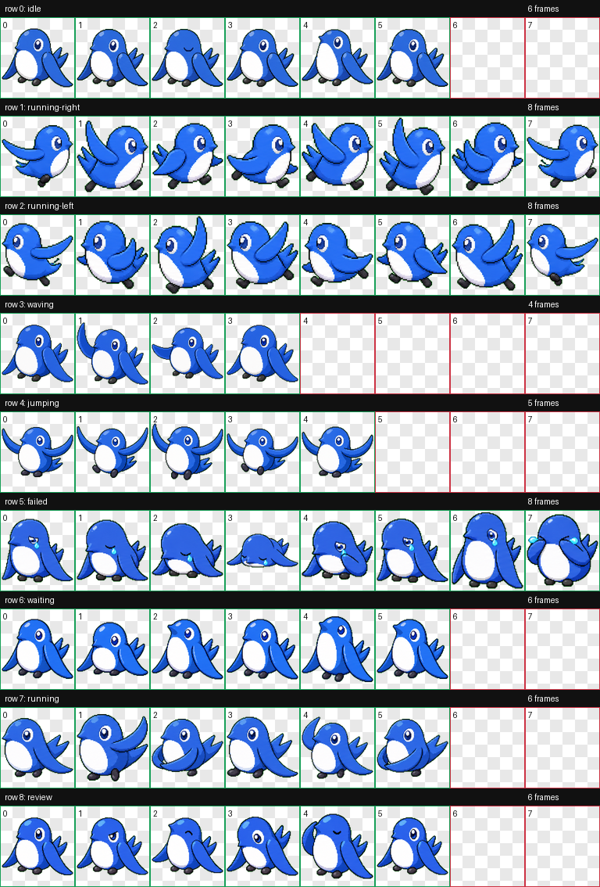

# Sweee Codex Pet Unofficial

> Unofficial fan-made Codex pet inspired by freee's official Sweee character.
> This project is not affiliated with, endorsed by, or sponsored by freee.

This repository contains a Codex-compatible custom pet package generated for personal use. It adapts the feel of freee's official Sweee character into a small pixel-art-adjacent Codex workspace companion.

## Preview



## Unofficial Notice

Sweee is an official character of freee. The Sweee character, freee name, and related trademarks or source materials belong to freee.

This repository is a personal, unofficial fan-made pet package. It does not include official freee artwork, logos, or source reference images, and it must not be presented as an official freee distribution.

Official Sweee page: https://www.freee.co.jp/lp/sweee/

## Files

- `pet/pet.json` - Codex pet manifest.
- `pet/spritesheet.webp` - Codex 8x9 pet spritesheet.
- `qa/contact-sheet.png` - Visual QA contact sheet for all animation rows.
- `qa/validation.json` - Atlas validation output.
- `qa/review.json` - Frame extraction and QA output.
- `previews/idle.mp4` - Small idle animation preview.

## Install Locally

Copy the `pet` directory contents into your Codex pet directory:

```bash
mkdir -p ~/.codex/pets/sweee
cp pet/pet.json ~/.codex/pets/sweee/pet.json
cp pet/spritesheet.webp ~/.codex/pets/sweee/spritesheet.webp
```

Then select or reload the custom pet in Codex.

## Validation

The generated atlas was validated as:

- Format: WebP
- Mode: RGBA
- Size: 1536x1872
- Validation errors: none
- Validation warnings: none

## Usage Boundary

This repo is intended for personal Codex customization and experimentation. Do not use it in a way that suggests freee created, approved, sponsors, or distributes this pet package.
